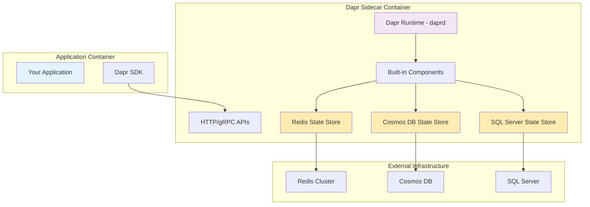
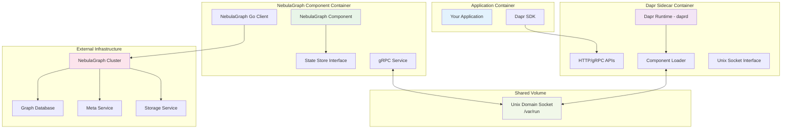
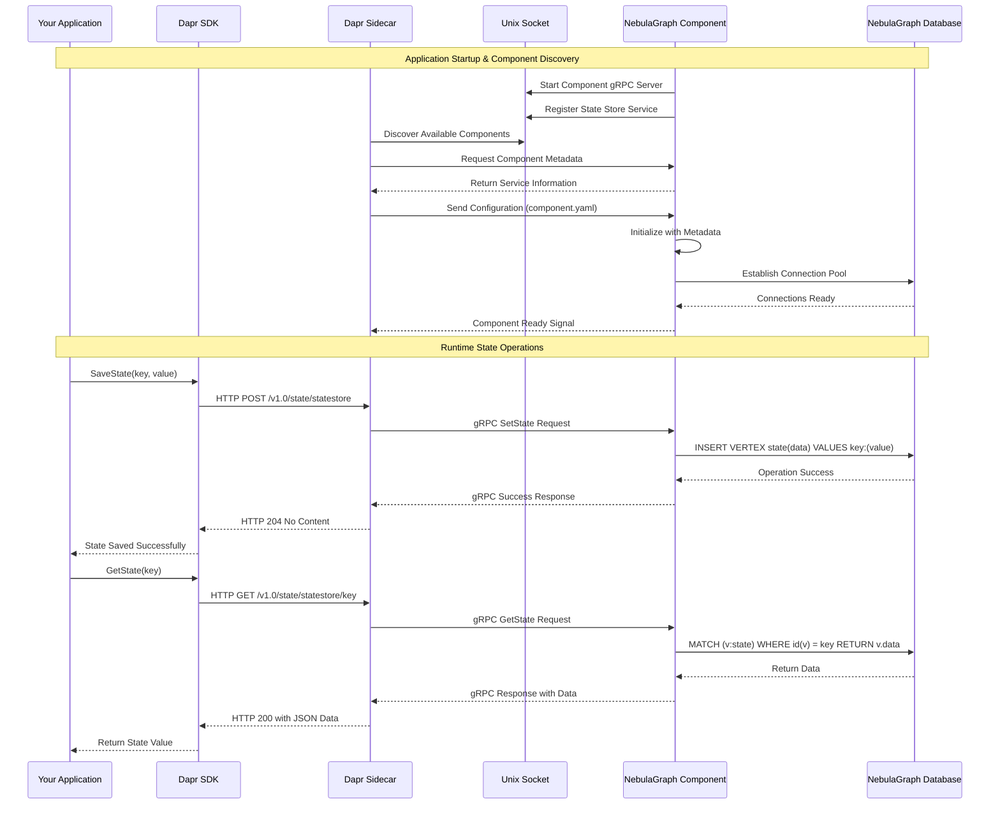
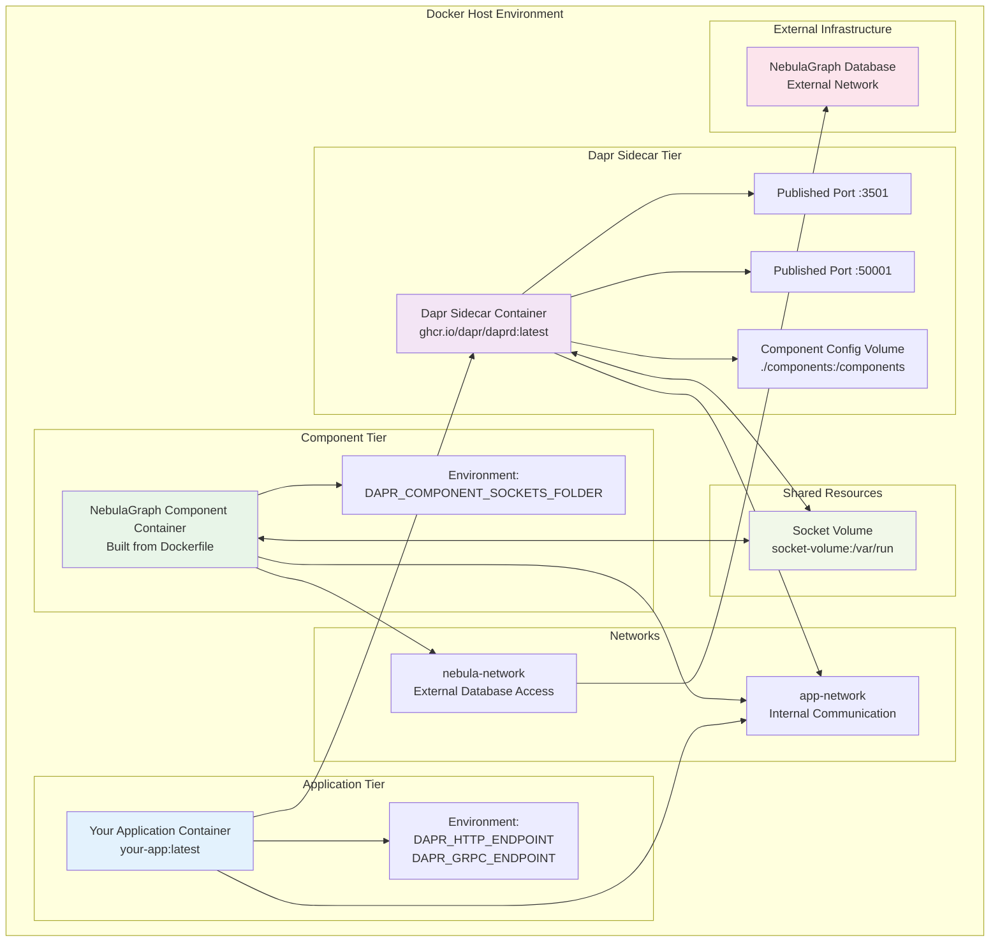
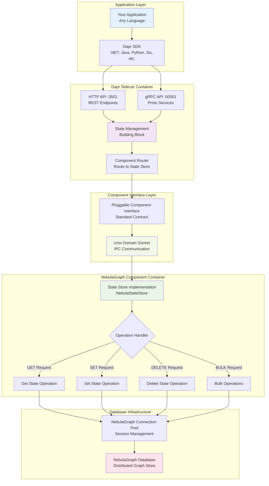
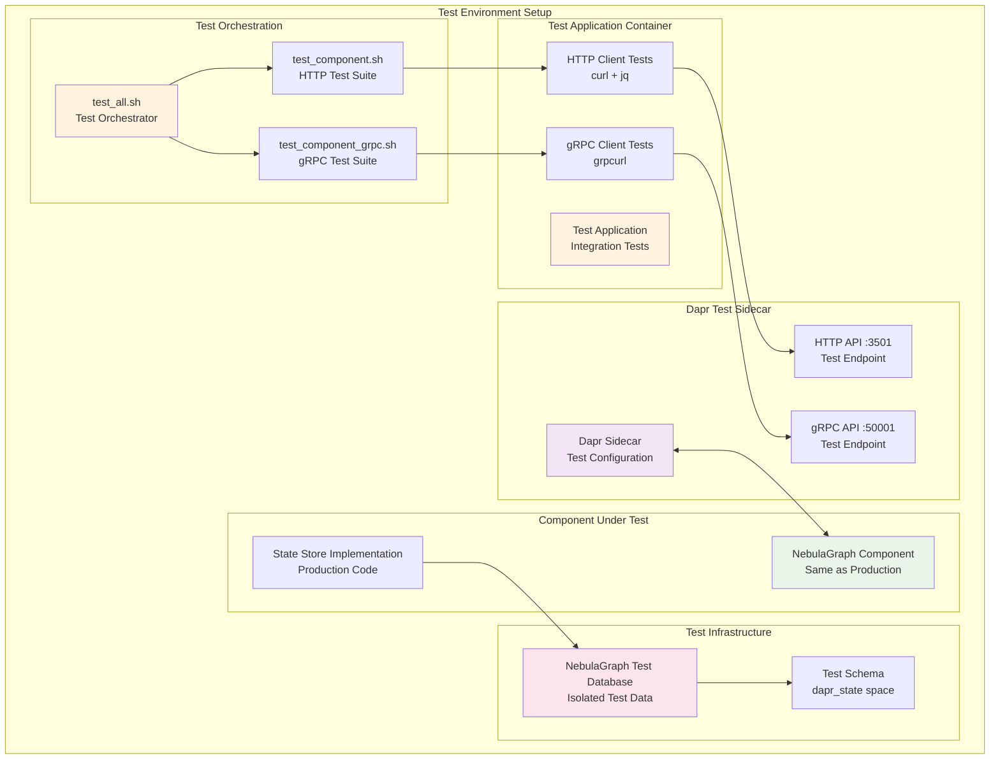

# Dapr Component Architecture - Standard Documentation Approach

## Application + Sidecar Pattern: Built-in vs Pluggable Components

Following standard Dapr and Docker documentation patterns:

### Built-in Component Architecture (Traditional)



### Pluggable Component Architecture (Our Implementation)



## Key Architectural Differences

### Built-in Components
- **Single Process**: Everything runs inside Dapr runtime
- **Language Constraint**: Must be written in Go
- **Release Coupling**: Updates tied to Dapr releases
- **Resource Sharing**: Shares memory/CPU with Dapr runtime
- **Distribution**: Bundled with Dapr installation

### Pluggable Components (Our Architecture)
- **Process Isolation**: Separate process/container
- **Language Freedom**: Any gRPC-supported language
- **Independent Releases**: Own versioning and deployment cycle
- **Resource Isolation**: Dedicated container resources
- **Custom Distribution**: Standalone container images

## Standard Application + Sidecar Communication Pattern



## Standard Docker Compose - Application + Sidecar + Component



## Standard State Management Flow - Application Perspective



## Standard Component Testing Architecture



## Standard Docker Compose Configuration Example

```yaml
# Following Standard Dapr Documentation Pattern
version: '3.8'

services:
  # Your Application (Example)
  my-application:
    image: my-app:latest
    container_name: my-application
    environment:
      - DAPR_HTTP_ENDPOINT=http://dapr-sidecar:3501
      - DAPR_GRPC_ENDPOINT=dapr-sidecar:50001
    depends_on:
      - dapr-sidecar
    networks:
      - app-network

  # Standard Dapr Sidecar
  dapr-sidecar:
    image: "ghcr.io/dapr/daprd:latest"
    container_name: dapr-sidecar
    command: |
      ./daprd 
      --app-id my-application
      --dapr-http-port 3501 
      --dapr-grpc-port 50001
      --components-path /components
      --log-level info
    environment:
      - DAPR_COMPONENTS_SOCKETS_FOLDER=/var/run
    ports:
      - "3501:3501"  # HTTP API
      - "50001:50001"  # gRPC API
    volumes:
      - components-socket:/var/run
      - ./components:/components:ro
    depends_on:
      - nebulagraph-component
    networks:
      - app-network

  # NebulaGraph Pluggable Component
  nebulagraph-component:
    build:
      context: .
      dockerfile: Dockerfile
    container_name: nebulagraph-state-component
    environment:
      - DAPR_COMPONENT_SOCKETS_FOLDER=/var/run
    volumes:
      - components-socket:/var/run
    networks:
      - app-network
      - nebula-network

  # Test Container (Optional - for CI/CD)
  component-tests:
    build:
      context: .
      dockerfile: Dockerfile.test
    container_name: component-tests
    environment:
      - DAPR_HTTP_ENDPOINT=http://dapr-sidecar:3501
      - DAPR_GRPC_ENDPOINT=dapr-sidecar:50001
    depends_on:
      - dapr-sidecar
    networks:
      - app-network
    profiles:
      - test

volumes:
  components-socket:

networks:
  app-network:
    driver: bridge
  nebula-network:
    external: true
    name: nebula-net
```

This standard architecture follows official Dapr and Docker documentation patterns, making it easy to understand, deploy, and maintain in production environments.
