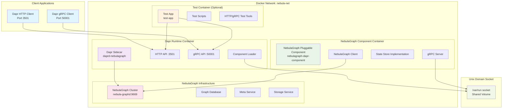
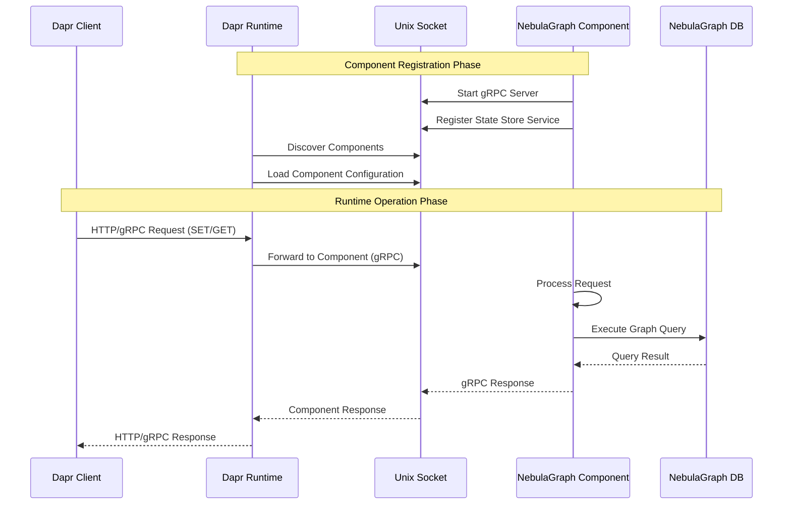
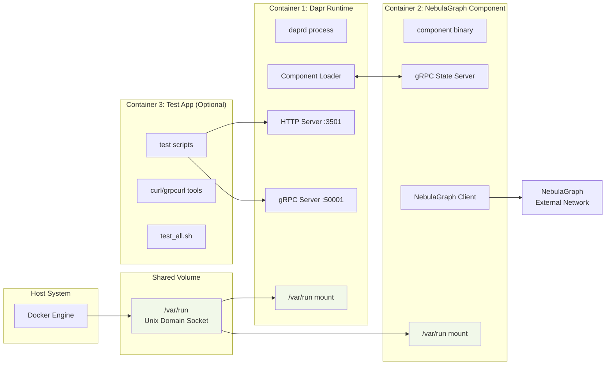
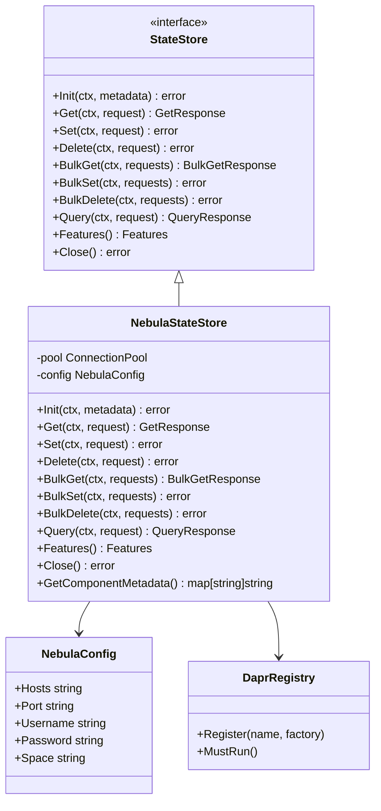
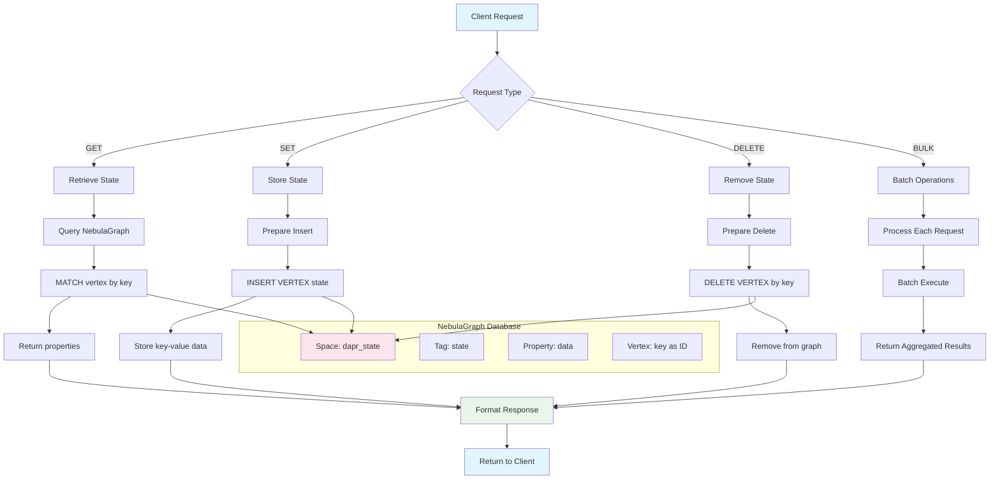
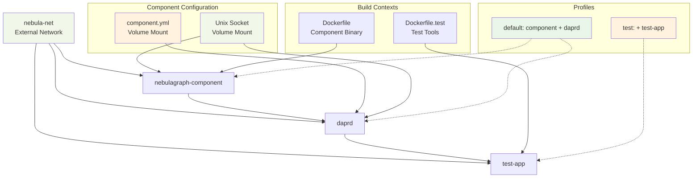
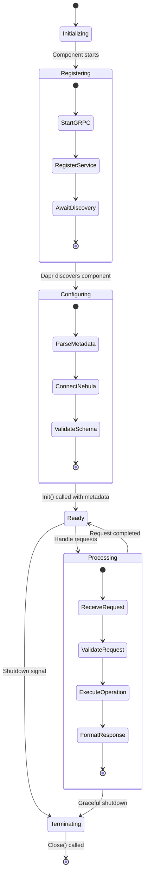
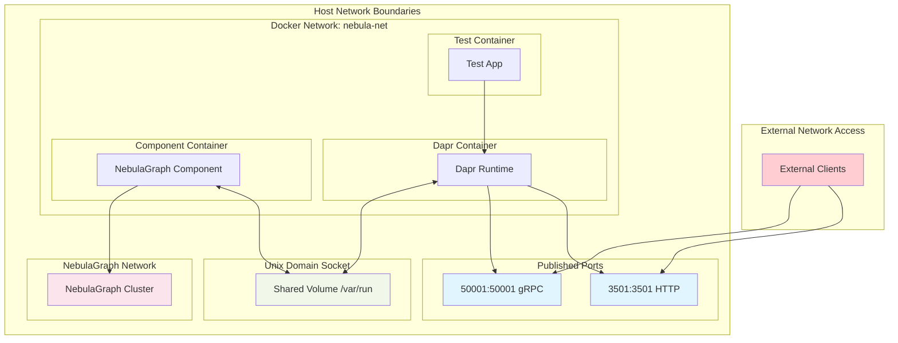

# NebulaGraph Dapr Pluggable Component Architecture Diagrams

## 1. Overall System Architecture

## 2. Dapr Pluggable Component Communication Flow

## 3. Container Architecture & Volume Mounting

## 4. Component Interface Implementation

## 5. Data Flow & State Management

## 6. Docker Compose Service Dependencies

## 7. Component Lifecycle & Registration

## 8. Security & Network Isolation

## Key Architecture Benefits

### 🔒 **Security**
- **Process Isolation**: Component runs in separate container
- **Network Isolation**: Internal Docker network communication
- **Socket Communication**: Unix Domain Sockets (not network ports)

### 🚀 **Performance**
- **Local Communication**: Unix sockets faster than network
- **Connection Pooling**: NebulaGraph connection pool
- **Stateless Design**: Each request is independent

### 🔄 **Scalability**
- **Independent Lifecycle**: Component updates without Dapr restart
- **Resource Management**: Container-level resource limits
- **Load Distribution**: Multiple component instances possible

### 🛠 **Maintainability**
- **Clear Separation**: Each service has single responsibility
- **Standard Interfaces**: Implements Dapr state store contract
- **Comprehensive Testing**: Automated test suite coverage

This architecture follows Dapr's pluggable component patterns and provides a robust, scalable solution for NebulaGraph integration.
