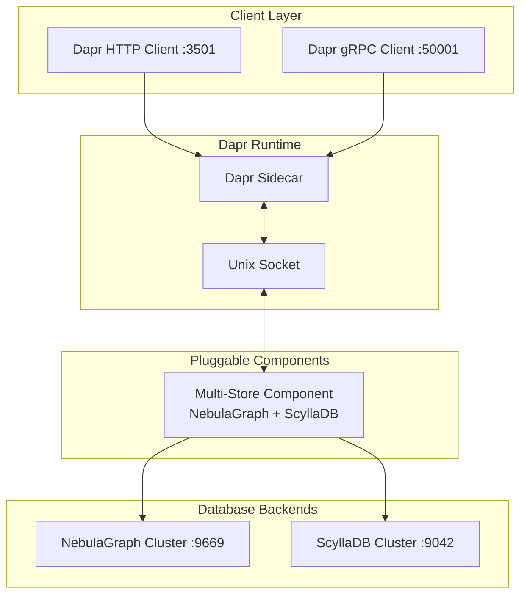
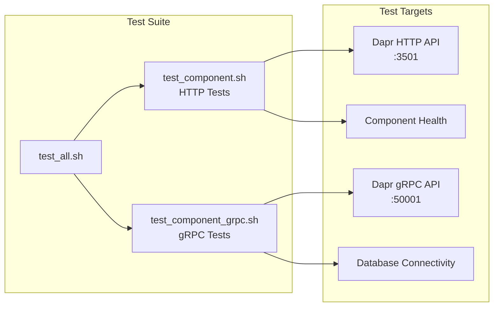

# Architecture Documentation

## System Overview

**Multi-Backend Dapr Pluggable Components** supporting NebulaGraph and ScyllaDB state stores.



## Component Implementation

### State Store Operations

| Operation | NebulaGraph Query | ScyllaDB Query |
|-----------|------------------|----------------|
| **Get** | `MATCH (v:state {key: $key}) RETURN v.data` | `SELECT data FROM dapr_state WHERE key = ?` |
| **Set** | `INSERT VERTEX state(key, data) VALUES $key: ($data)` | `INSERT INTO dapr_state (key, data) VALUES (?, ?)` |
| **Delete** | `DELETE VERTEX state WHERE key == $key` | `DELETE FROM dapr_state WHERE key = ?` |
| **Bulk** | `MATCH (v:state) WHERE v.key IN $keys RETURN v` | `SELECT * FROM dapr_state WHERE key IN ?` |

### Data Models

**NebulaGraph Schema:**
```sql
CREATE SPACE dapr_state;
CREATE TAG state (key string, data string, etag string);
CREATE TAG INDEX state_key_index ON state(key);
```

**ScyllaDB Schema:**
```sql
CREATE KEYSPACE dapr_state WITH replication = {'class': 'SimpleStrategy', 'replication_factor': 3};
CREATE TABLE state (key text PRIMARY KEY, data text, etag text);
```

## Deployment Architecture

### Multi-Component Setup

The same Go binary serves both backends using environment variables:

```yaml
services:
  nebulagraph-component:
    environment:
      - STORE_TYPE=nebulagraph
      - NEBULA_HOST=nebula-graphd:9669
  
  scylladb-component:
    environment:
      - STORE_TYPE=scylladb  
      - SCYLLA_HOSTS=scylladb-node:9042
```
    end
    
    subgraph "NebulaGraph Component Container"
        C1[NebulaGraph Component Process]
        C2[gRPC Server]
        C3[State Store Interface]
        C4[NebulaGraph Client]
    end
    
    subgraph "NebulaGraph Infrastructure"
        E1[NebulaGraph Cluster]
    end
    
    A2 --> S2
    S1 --> S3
    S3 <--> C2
    C2 --> C3
    C4 --> E1
    
    style A1 fill:#e3f2fd
    style S1 fill:#f3e5f5
    style C1 fill:#e8f5e8
    style E1 fill:#fce4ec
```

## Technical Implementation

### Component Structure

```
src/dapr-pluggable-components/
├── main.go                    # Entry point & Dapr registration
├── stores/
│   └── nebulagraph_store.go  # State store implementation
├── Dockerfile                # Production container
├── go.mod                    # Go dependencies
└── tests/                    # Test suites
```

### State Store Operations

The component implements the Dapr state store interface:

| Operation | HTTP Endpoint | gRPC Method | NebulaGraph Implementation |
|-----------|---------------|-------------|---------------------------|
| **Get** | `GET /state/{store}/{key}` | `GetState` | `MATCH (v:state {key: $key}) RETURN v.data` |
| **Set** | `POST /state/{store}` | `SaveState` | `INSERT VERTEX state(key, data, etag) VALUES $key: ($key, $data, $etag)` |
| **Delete** | `DELETE /state/{store}/{key}` | `DeleteState` | `DELETE VERTEX state WHERE key == $key` |
| **Bulk Get** | `POST /state/{store}/bulk` | `GetBulkState` | `MATCH (v:state) WHERE v.key IN $keys RETURN v` |

### Data Model

NebulaGraph schema for state storage:

```sql
-- Space for Dapr state data
CREATE SPACE IF NOT EXISTS dapr_state (vid_type=FIXED_STRING(256));

-- State vertex type
CREATE TAG IF NOT EXISTS state (
    key string NOT NULL,
    data string,
    etag string,
    created timestamp DEFAULT timestamp(),
    modified timestamp DEFAULT timestamp()
);

-- Index for efficient key lookups
CREATE TAG INDEX state_key_index ON state(key);
```

## Container Architecture

### Docker Compose Structure

```yaml
services:
  # Dapr sidecar
  daprd-nebulagraph:
    image: daprio/daprd:latest
    depends_on: [nebulagraph-dapr-component]
    volumes:
      - ./components:/components
      - /var/run:/var/run
    
  # NebulaGraph component
  nebulagraph-dapr-component:
    build: .
    volumes:
      - /var/run:/var/run
    depends_on: [nebula-graphd]
    
  # NebulaGraph database
  nebula-graphd:
    image: vesoft/nebula-graphd:latest
    depends_on: [nebula-metad, nebula-storaged]
```

### Component Registration

The component registers with Dapr at startup:

```go
// Component registration with Dapr
func main() {
    dapr.Register("nebulagraph-state", dapr.NewStateStore(func() dapr.StateStore {
        return &NebulaGraphStateStore{}
    }))
    dapr.MustRun()
}
```

## Network Communication

### Port Configuration

| Service | Port | Protocol | Purpose |
|---------|------|----------|---------|
| Dapr HTTP API | 3501 | HTTP | Client communication |
| Dapr gRPC API | 50001 | gRPC | Client communication |
| NebulaGraph | 9669 | TCP | Database access |
| Component | Unix Socket | gRPC | Dapr ↔ Component |

### Development vs Production

**Development Setup:**
- All services in Docker containers
- Shared Docker network
- Local volume mounts
- Debug logging enabled

**Production Setup:**
- Kubernetes deployment
- Service mesh integration
- Secret management
- Resource limits and monitoring

## Testing Architecture

### Test Structure



### Test Coverage

- **Unit Tests**: Component logic validation
- **Integration Tests**: Dapr ↔ Component communication
- **End-to-End Tests**: Client → Dapr → Component → NebulaGraph
- **Cross-Protocol Tests**: HTTP and gRPC interoperability

## Performance Considerations

### Connection Management
- **Connection Pooling**: NebulaGraph client pool
- **Unix Socket**: High-performance IPC with Dapr
- **Async Operations**: Non-blocking I/O where possible

### Scalability
- **Horizontal Scaling**: Multiple component instances
- **NebulaGraph Cluster**: Distributed graph storage
- **Load Balancing**: Dapr handles component discovery

### Monitoring
- **Metrics**: Component and database metrics
- **Logging**: Structured logging for debugging
- **Health Checks**: Component and dependency health

## Security

### Component Security
- **Unix Socket**: Secure local communication
- **No Network Exposure**: Component not directly accessible
- **Dapr Security**: Leverages Dapr's security model

### Database Security
- **Authentication**: Username/password authentication
- **Network Isolation**: Private Docker network
- **Connection Security**: TLS for production deployments

## Deployment Patterns

### Local Development
```bash
# Infrastructure
cd src/dependencies && ./environment_setup.sh

# Component
cd src/dapr-pluggable-components && ./run_nebula.sh start
```

### Kubernetes Deployment
```yaml
apiVersion: dapr.io/v1alpha1
kind: Component
metadata:
  name: nebulagraph-state
spec:
  type: state.nebulagraph-state
  version: v1
  metadata:
  - name: hosts
    value: "nebula-graphd:9669"
```

## Troubleshooting

### Common Issues

| Issue | Symptom | Solution |
|-------|---------|----------|
| Component not registering | HTTP 500 errors | Check Unix socket permissions |
| Database connection failed | Timeout errors | Verify NebulaGraph cluster health |
| State not persisting | Data loss | Check space initialization |
| Performance issues | Slow responses | Monitor connection pool usage |

### Debug Commands
```bash
# Check component logs
docker logs nebulagraph-dapr-component

# Test database connectivity
docker exec nebula-console nebula-console -addr nebula-graphd -port 9669

# Test Dapr APIs
curl http://localhost:3501/v1.0/state/nebulagraph-state/test-key
```

## References

- [Dapr Pluggable Components](https://docs.dapr.io/operations/components/pluggable-components/)
- [Dapr State Store API](https://docs.dapr.io/reference/api/state_api/)
- [NebulaGraph Documentation](https://docs.nebula-graph.io/)
- [NebulaGraph Go Client](https://github.com/vesoft-inc/nebula-go)
