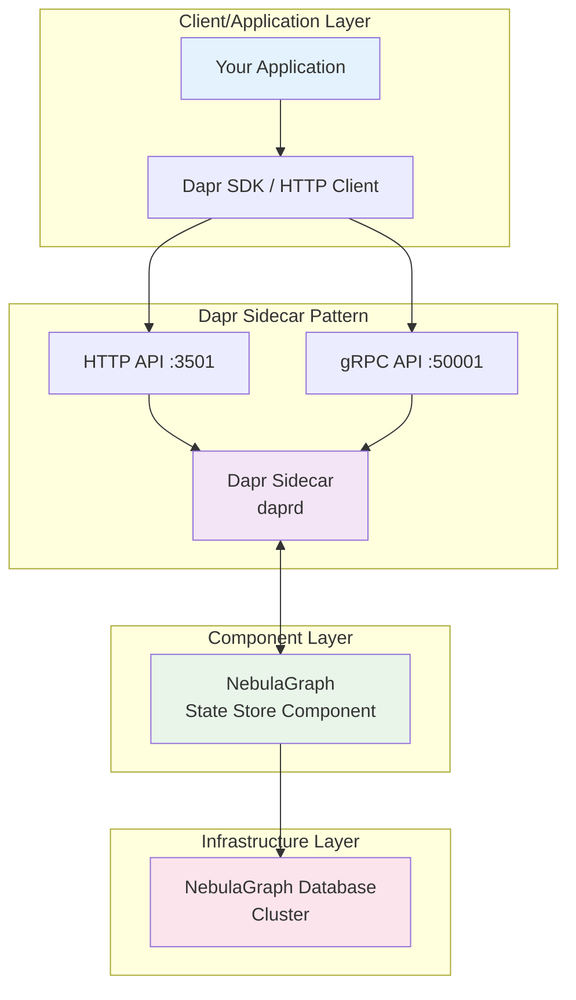
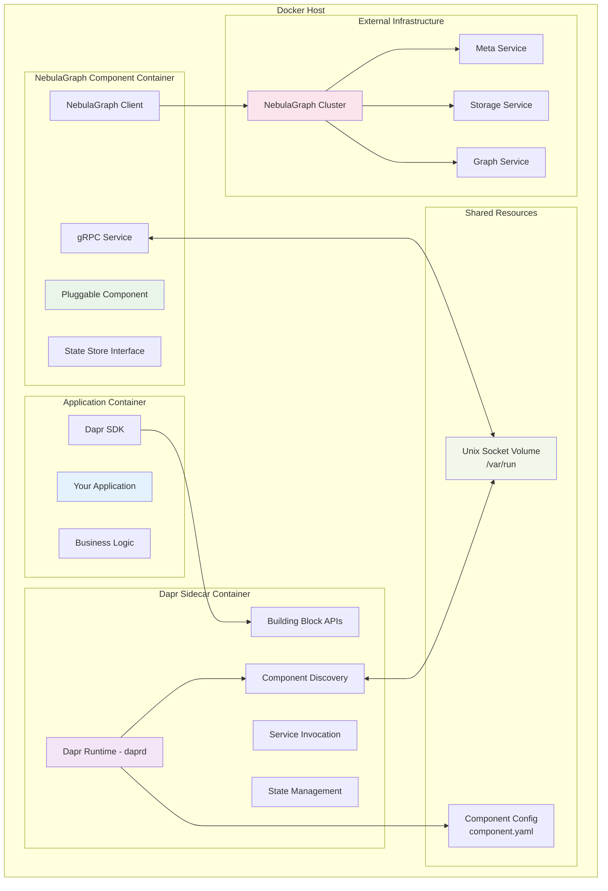
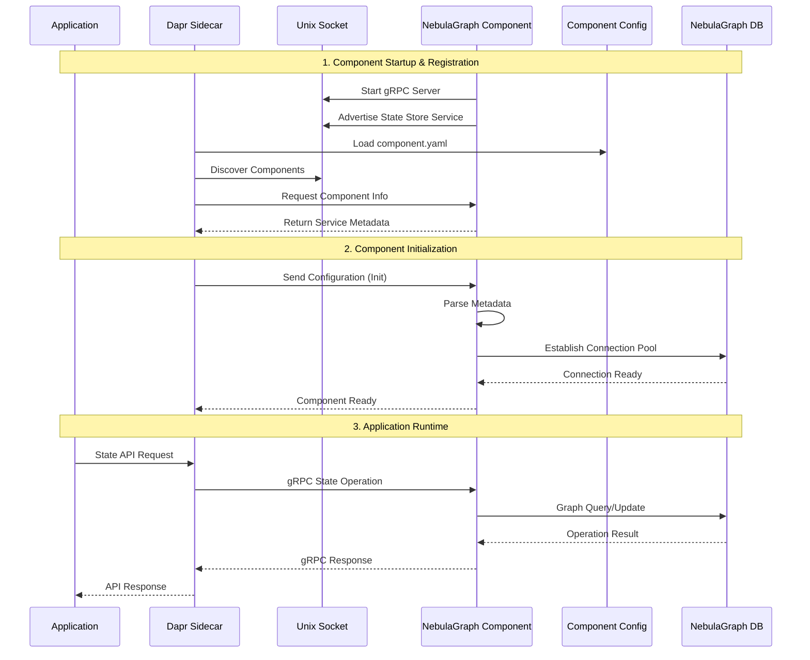
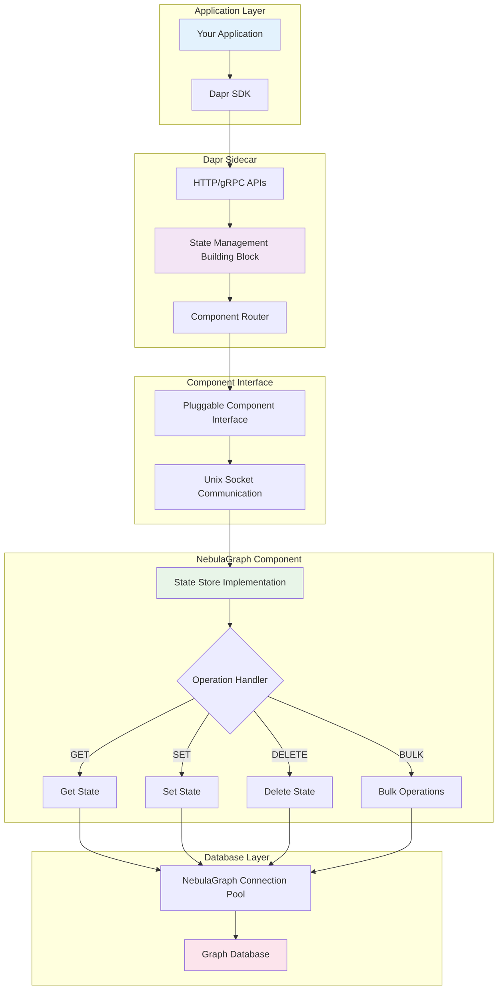
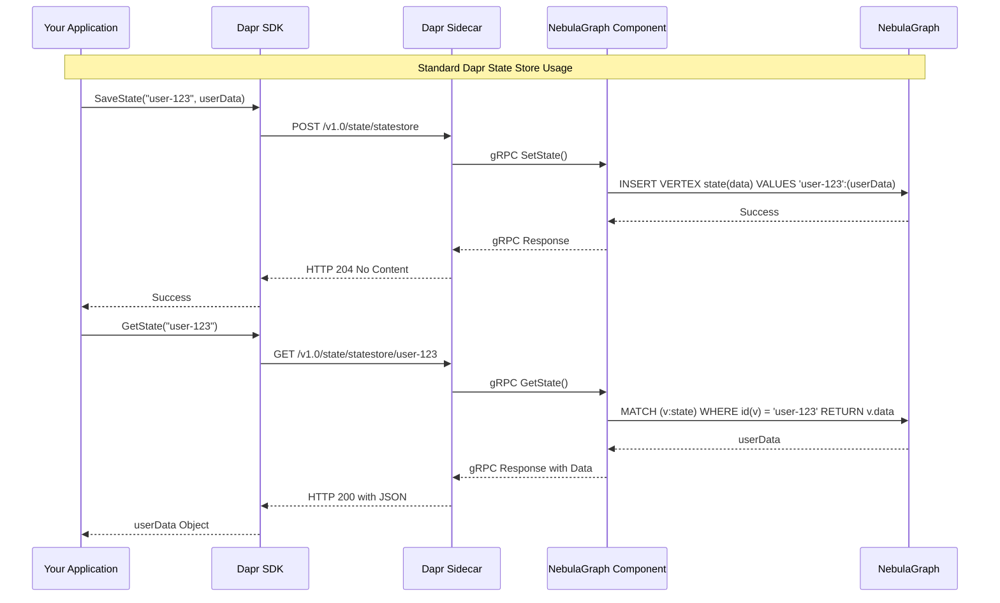
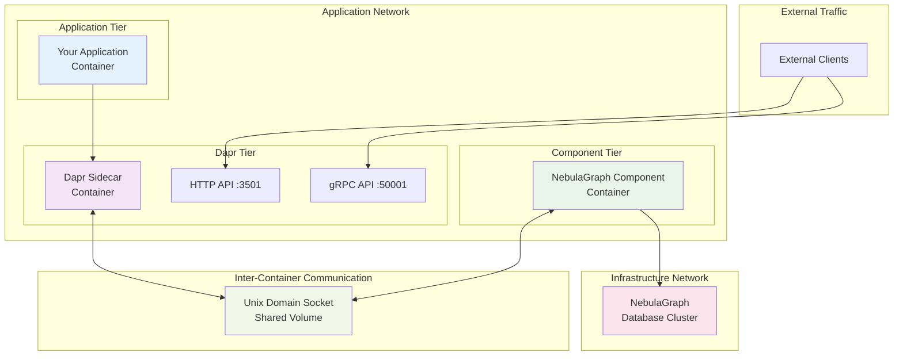
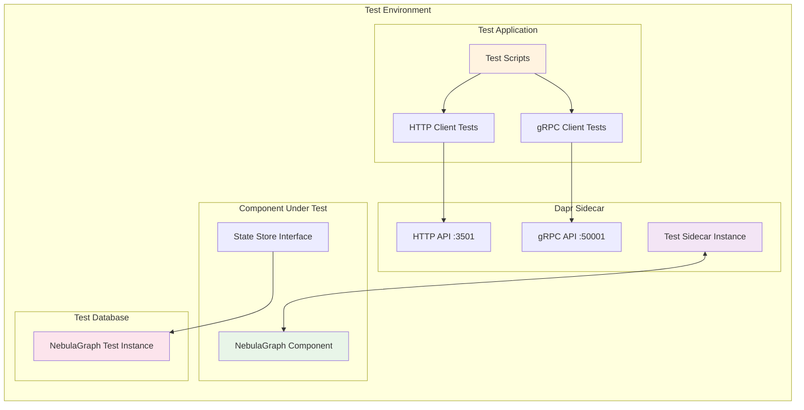

# NebulaGraph Dapr Component - Standard Architecture Documentation

## Application + Sidecar Pattern Architecture

Following the standard Dapr documentation approach, our architecture implements the **Application + Sidecar** pattern with **Pluggable Components**.

### 1. Standard Dapr Application Architecture



### 2. Container Architecture - Application + Sidecar + Component



### 3. Component Registration Flow (Standard Dapr Pattern)



### 4. Standard Docker Compose - Sidecar Pattern

```yaml
# Standard Dapr Application + Sidecar + Component Pattern
version: '3.8'

services:
  # Your Application Container
  app:
    image: your-app:latest
    container_name: my-application
    environment:
      - DAPR_HTTP_ENDPOINT=http://dapr-sidecar:3501
      - DAPR_GRPC_ENDPOINT=dapr-sidecar:50001
    depends_on:
      - dapr-sidecar
    networks:
      - app-network

  # Dapr Sidecar Container
  dapr-sidecar:
    image: "ghcr.io/dapr/daprd:latest"
    container_name: dapr-sidecar
    command: |
      ./daprd 
      --app-id my-app 
      --dapr-http-port 3501 
      --dapr-grpc-port 50001
      --components-path /components
      --log-level debug
    environment:
      - DAPR_COMPONENTS_SOCKETS_FOLDER=/var/run
    ports:
      - "3501:3501"  # Dapr HTTP API
      - "50001:50001"  # Dapr gRPC API
    volumes:
      - socket-volume:/var/run
      - ./components:/components
    depends_on:
      - nebulagraph-component
    networks:
      - app-network

  # NebulaGraph Pluggable Component
  nebulagraph-component:
    build:
      context: .
      dockerfile: Dockerfile
    container_name: nebulagraph-component
    environment:
      - DAPR_COMPONENT_SOCKETS_FOLDER=/var/run
    volumes:
      - socket-volume:/var/run
    networks:
      - app-network
      - nebula-network

volumes:
  socket-volume:

networks:
  app-network:
  nebula-network:
    external: true
```

### 5. State Management Flow - Standard Pattern



### 6. Component Configuration - Standard Approach

```yaml
# Standard Dapr Component Configuration
apiVersion: dapr.io/v1alpha1
kind: Component
metadata:
  name: statestore
  namespace: default
spec:
  type: state.nebulagraph-state
  version: v1
  metadata:
  # Connection Configuration
  - name: hosts
    value: "nebula-graphd-1,nebula-graphd-2,nebula-graphd-3"
  - name: port
    value: "9669"
  - name: username
    value: "root"
  - name: password
    secretKeyRef:
      name: nebula-secret
      key: password
  - name: space
    value: "dapr_state"
  
  # Performance Configuration  
  - name: connectionTimeout
    value: "10s"
  - name: executionTimeout
    value: "30s"
  - name: maxConnections
    value: "100"
```

### 7. Application Usage Pattern



### 8. Network Architecture - Standard Docker Pattern



### 9. Testing Architecture - Standard Approach



## Key Benefits of This Standard Architecture

### 🏗️ **Standard Dapr Patterns**
- **Sidecar Pattern**: Clean separation between app and infrastructure
- **Component Interface**: Standard state store contract implementation
- **Configuration-Driven**: YAML-based component configuration
- **SDK Integration**: Works with all Dapr SDKs (.NET, Java, Python, Go, etc.)

### 🔧 **Pluggable Component Benefits**
- **Language Freedom**: Component written in Go, app can be any language
- **Independent Scaling**: Scale component separately from application
- **Isolated Updates**: Update component without touching application
- **Resource Isolation**: Dedicated resources for state management

### 🚀 **Production Ready**
- **Container Orchestration**: Standard Docker/Kubernetes deployment
- **Health Monitoring**: Built-in health checks and metrics
- **Security**: Network isolation and secret management
- **High Availability**: Component clustering and failover support

This architecture follows the official Dapr documentation patterns while providing robust NebulaGraph integration through the pluggable component model.
