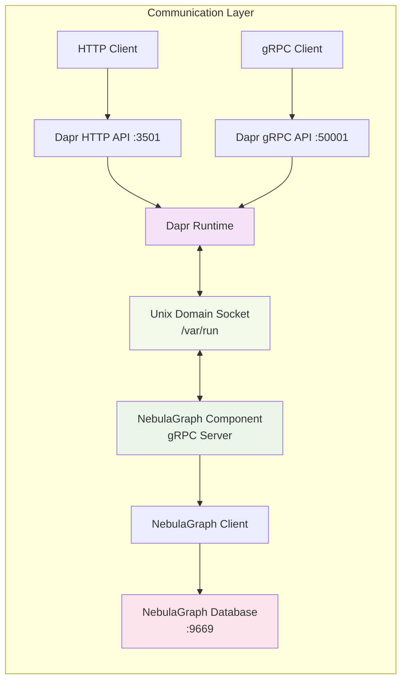
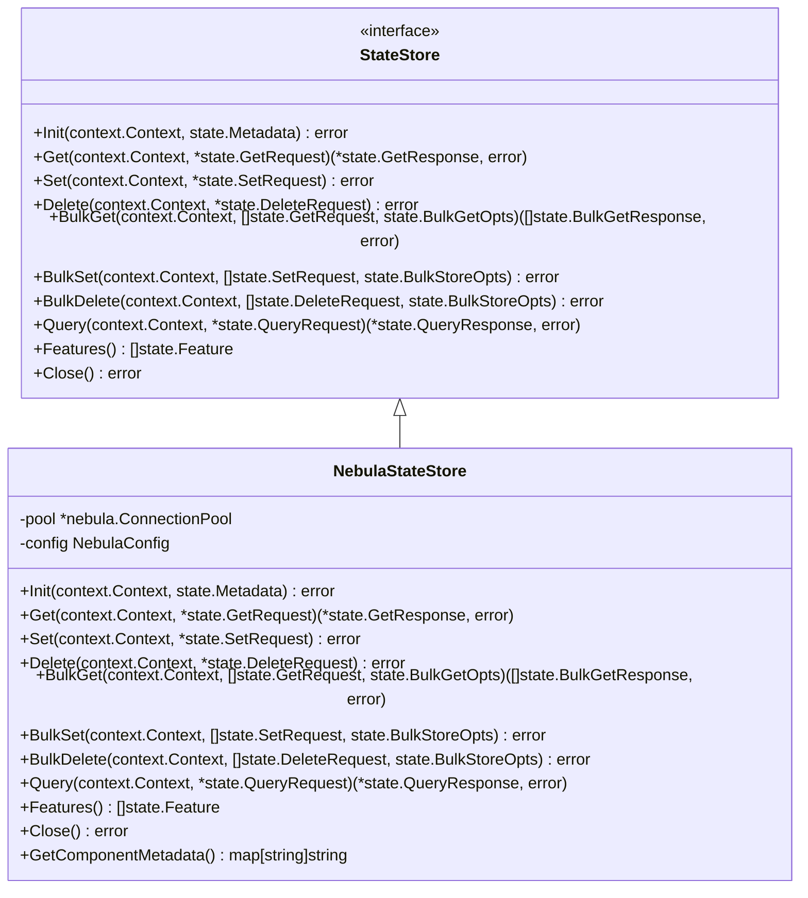
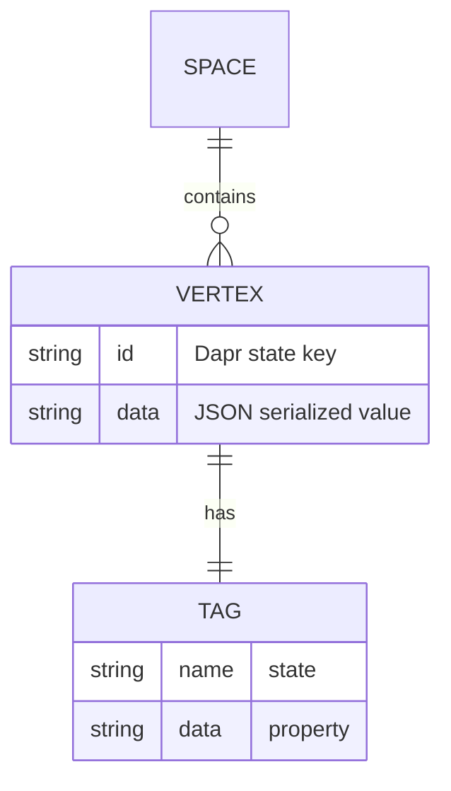
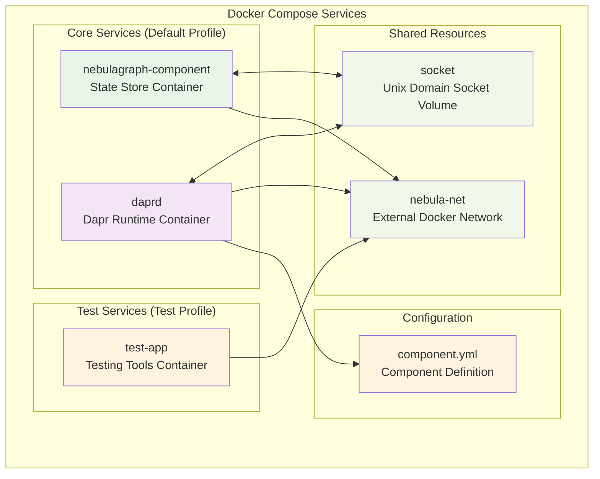
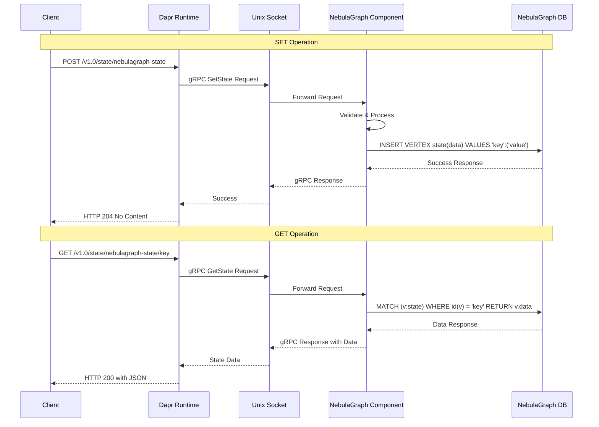
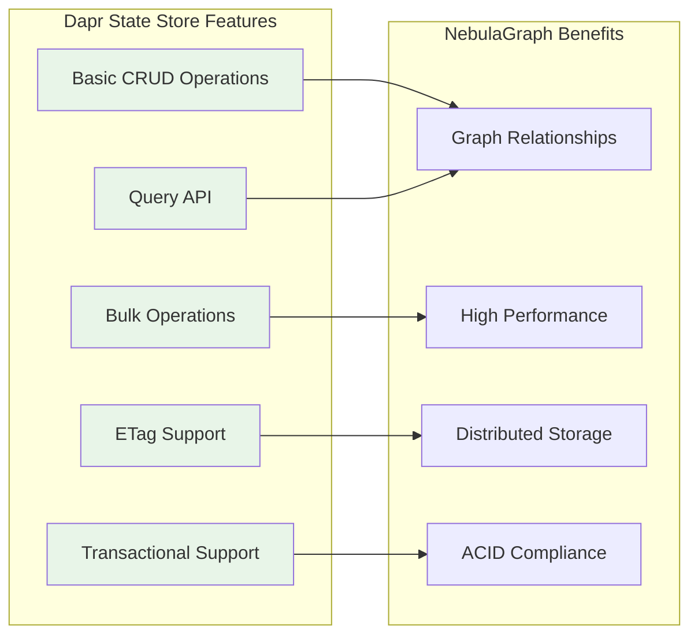
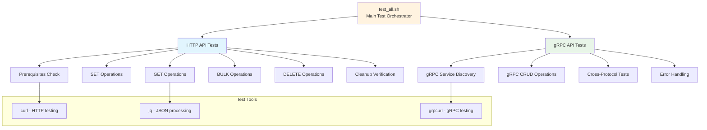

# NebulaGraph Dapr Pluggable Component - Technical Architecture

## Architecture Overview

The NebulaGraph Dapr Pluggable Component follows Dapr's official pluggable component architecture, providing a state store implementation that integrates NebulaGraph as the backend storage system.

## Core Components

### 1. Component Structure

```
src/dapr-pluggable/
├── main.go                    # Entry point & Dapr registration
├── Dockerfile                 # Production container image
├── Dockerfile.test           # Testing container image
├── stores/
│   └── nebulagraph_store.go  # State store implementation
├── tests/
│   ├── test_all.sh           # Complete test suite
│   ├── test_component.sh     # HTTP API tests
│   └── test_component_grpc.sh # gRPC API tests
└── setup/
    └── docker/
        └── docker-compose.yml # Multi-container orchestration
```

### 2. Communication Architecture



## Implementation Details

### 3. Registration Pattern

```go
// main.go - Dapr component registration
func main() {
    dapr.Register("nebulagraph-state", dapr.WithStateStore(func() state.Store {
        return &stores.NebulaStateStore{}
    }))
    dapr.MustRun()
}
```

### 4. Interface Implementation



### 5. Data Storage Model



**NebulaGraph Schema:**
- **Space**: `dapr_state`
- **Tag**: `state` with property `data`
- **Vertex ID**: Dapr state key
- **Property**: JSON-serialized state value

## Container Architecture

### 6. Multi-Container Setup



### 7. Volume Mounting Strategy

```yaml
# docker-compose.yml excerpt
volumes:
  socket:  # Shared Unix Domain Socket

services:
  nebulagraph-component:
    volumes:
      - socket:/var/run  # Component writes socket
      
  daprd:
    volumes:
      - socket:/var/run  # Dapr reads socket
      - component.yml:/components/component.yml  # Configuration
```

## Request Processing Flow

### 8. State Operations Sequence



## Feature Support

### 9. Implemented Features



**Supported Features:**
- ✅ `FeatureETag` - Optimistic concurrency control
- ✅ `FeatureTransactional` - ACID transactions
- ✅ `FeatureQueryAPI` - Advanced querying capabilities

## Testing Architecture

### 10. Comprehensive Test Coverage



## Security & Isolation

### 11. Security Boundaries

```mermaid
graph TB
    subgraph "Network Security"
        A[External Access] --> B[Published Ports Only<br/>3501, 50001]
        B --> C[Dapr Runtime Container]
        C --> D[Internal Docker Network<br/>nebula-net]
    end
    
    subgraph "Process Isolation"
        E[Host System] --> F[Container Runtime]
        F --> G[Isolated Namespaces]
        G --> H[Component Process]
        G --> I[Dapr Process]
    end
    
    subgraph "Communication Security"
        J[Unix Domain Socket] --> K[Local File System]
        K --> L[Volume Mount]
        L --> M[Shared Between Containers]
    end
    
    style A fill:#ffcdd2
    style B fill:#e1f5fe
    style D fill:#f1f8e9
    style H fill:#e8f5e8
    style I fill:#f3e5f5
    style J fill:#f1f8e9
```



## Performance Characteristics

### 12. Performance Optimizations

- **Connection Pooling**: Reuses NebulaGraph connections
- **Unix Socket Communication**: Faster than TCP networking
- **Batch Operations**: Efficient bulk processing
- **Stateless Design**: Horizontal scaling capability
- **Memory Efficient**: Distroless container base image

## Deployment Considerations

### 13. Production Deployment

```yaml
# Example production configuration
apiVersion: dapr.io/v1alpha1
kind: Component
metadata:
  name: nebulagraph-state
spec:
  type: state.nebulagraph-state
  version: v1
  metadata:
  - name: hosts
    value: "nebula-cluster-lb.internal"
  - name: port
    value: "9669"
  - name: username
    secretKeyRef:
      name: nebula-credentials
      key: username
  - name: password
    secretKeyRef:
      name: nebula-credentials
      key: password
  - name: space
    value: "production_state"
```

This architecture provides a robust, scalable, and maintainable solution for integrating NebulaGraph with Dapr's state management capabilities.
